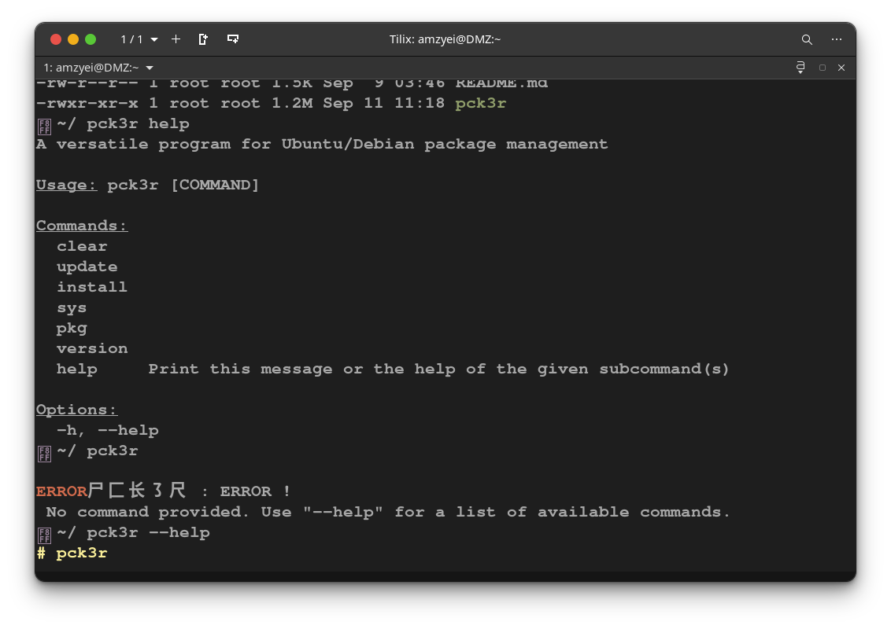

# Pck3r



Pck3r is a user-friendly command-line tool designed for Linux novices. Written in Python, it simplifies package management and system operations on Ubuntu and all Debian-based distributions using the apt package manager.

Pck3r is created by Amzyei (Amin Azimi) and is licensed under GPL3. Contributions are welcome—feel free to send pull requests on GitHub: https://github.com/amzy31/pck3r. New features will be added to Pck3r soon!

## Logo

```
  尸⼕长㇌尺
```

## Overview

Hey Linux friends! Pck3r makes Ubuntu/Debian package management simple and fun. No more complex apt commands - just easy, memorable ones. Perfect for beginners and pros alike!

## Commands

### Install Command

Install packages or tools:

```bash
pck3r install <package>
```

Examples:
- `pck3r install nodejs`
- `pck3r install ohmyzsh`
- `pck3r install <any_package>`

### Clear Command

Clear your terminal screen:

```bash
pck3r clear
```

### System Commands

Manage your operating system:

- Update package lists:
  ```bash
  pck3r sys update
  ```

- Upgrade installed packages:
  ```bash
  pck3r sys upgrade
  ```

- Full upgrade (update and upgrade):
  ```bash
  pck3r sys updgr
  ```

### Package Search

Search for available packages:

```bash
pck3r pkg <package_name>
```

This uses `apt search` to find packages.

### Version

Check Pck3r version:

```bash
pck3r version
```

## Installation

To install Pck3r globally:

1. Ensure Python 3 is installed on your system (comes pre-installed on most Linux distributions)

2. Clone the repository:
   ```bash
   git clone https://github.com/amzy31/pck3r
   ```

3. Navigate to the directory:
   ```bash
   cd pck3r
   ```

4. Install globally:
   ```bash
   make install
   ```

Or run directly:
```bash
python3 main.py <command>
```

## Update

To update Pck3r to the latest version:

```bash
git pull origin master
```

Then reinstall:
```bash
make install
```

Or use the built-in update command:
```bash
pck3r update
```
